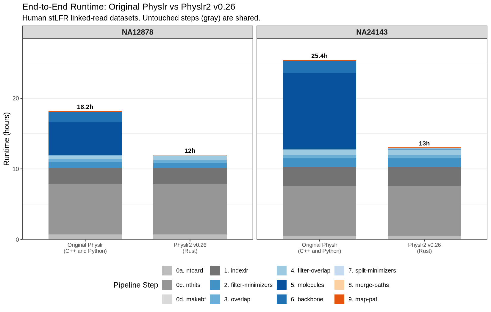
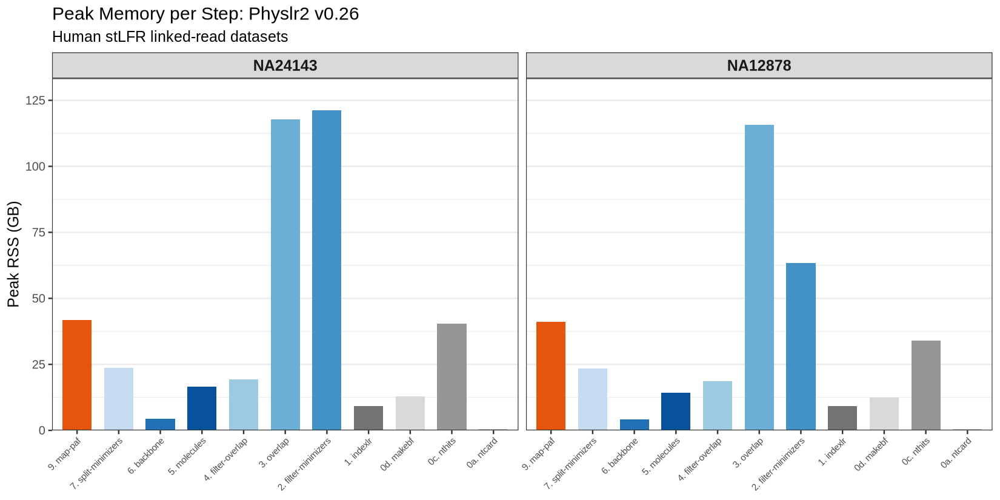
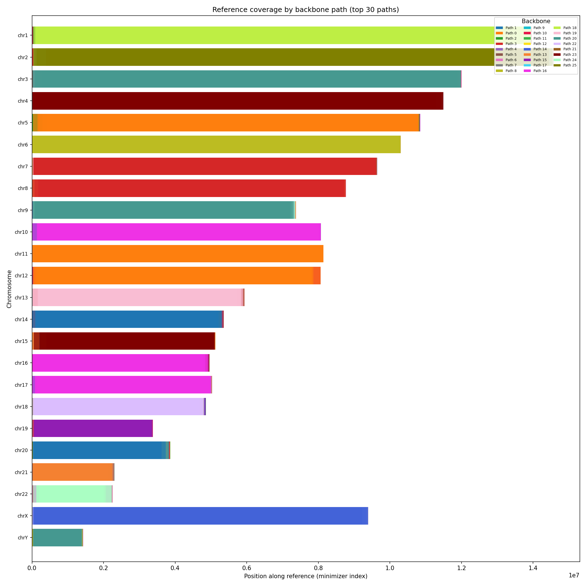
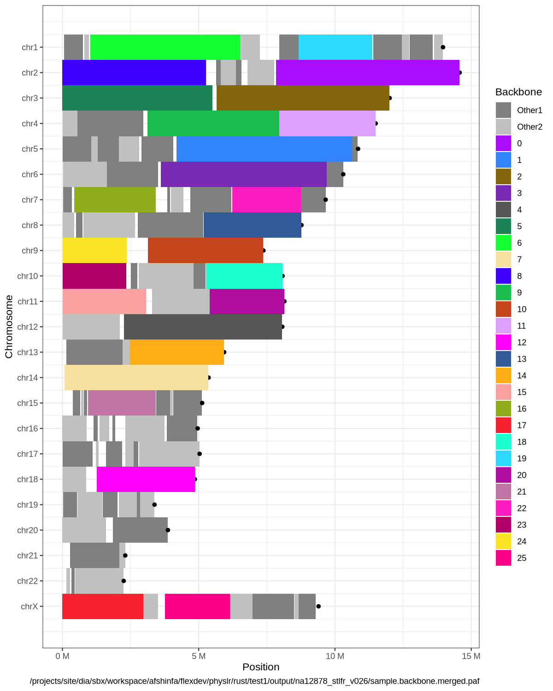
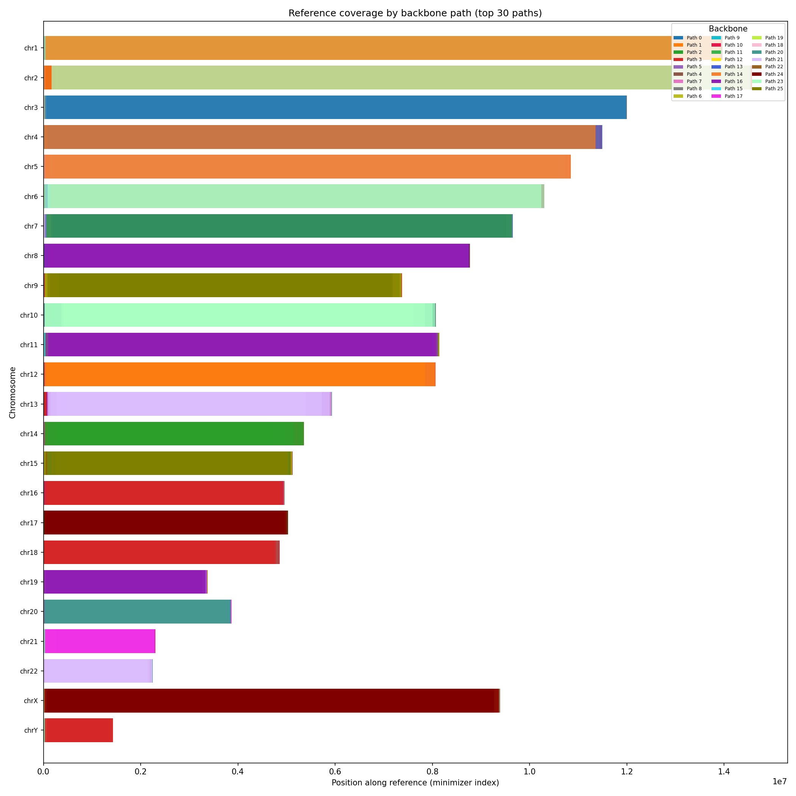
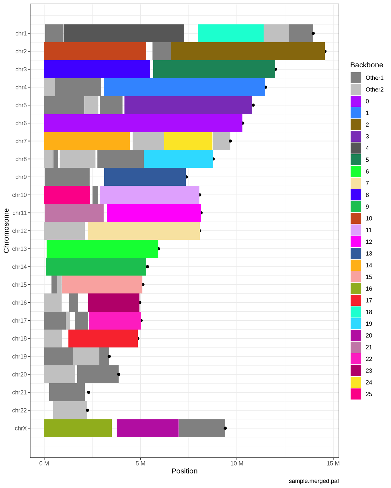

# Physlr2: Performance Comparison

Comparison of physical maps produced by the original Physlr (C++ and Python) and Physlr2 v0.26 (Rust) on two human cell lines using stLFR linked reads.

## Tools

| Tool | Language | Repository |
|------|----------|------------|
| **Original Physlr** | C++ and Python | [bcgsc/physlr](https://github.com/bcgsc/physlr) |
| **Physlr2 v0.26** | Rust | [aafshinfard/physlr2](https://github.com/aafshinfard/physlr2) |

## Datasets

| Sample | Technology | Source |
|--------|-----------|--------|
| NA12878 | stLFR | [GIAB FTP](https://ftp-trace.ncbi.nlm.nih.gov/ReferenceSamples/giab/data/NA12878/stLFR/) |
| NA24143 | stLFR | [GIAB FTP](https://ftp-trace.ncbi.nlm.nih.gov/ReferenceSamples/giab/data/AshkenazimTrio/HG004_NA24143_mother/stLFR/) |

Reference: GRCh38 (no alt analysis set). Benchmarked on a single compute node, 16 CPUs, 200 GB RAM.

---

## Runtime and Memory

End-to-end pipeline runtime for both tools. The initial steps (gray: ntcard, nthits, makebf, indexlr) are untouched and shared between both implementations. The rewritten steps (blue/orange: filter-minimizers through map-paf) are where Physlr2 differs.

Physlr2 v0.26 uses a cascading Bloom filter for singleton removal in filter-minimizers, reducing memory by ~40% compared to the exact HashMap approach. The molecules step uses deterministic binning (seed=42).

| Sample | Original Physlr | Physlr2 v0.26 | Speedup |
|--------|:-:|:-:|:-:|
| NA12878 | 18.2h | 12.0h | **1.5×** |
| NA24143 | 25.4h | 13.0h | **2.0×** |

Physlr-specific steps only (molecules + backbone + map-paf):

| Sample | Original Physlr | Physlr2 v0.26 | Speedup |
|--------|:-:|:-:|:-:|
| NA12878 | 22,545s (6.3h) | 733s (12 min) | **31×** |
| NA24143 | 45,527s (12.6h) | 928s (15 min) | **49×** |

Peak memory is dominated by the overlap step (~116–121 GB) and filter-minimizers (~63–121 GB). The rewritten steps (molecules, backbone, merge-paths) use 4–17 GB.

---

## Physical Maps

Reference chromosomes colored by backbone path. Each solid-color bar represents a single backbone path mapped to the reference genome.

### NA12878

| Original Physlr | Physlr2 v0.26 |
|:---:|:---:|
|  |  |
| 183 backbone paths | 102 backbone paths |

### NA24143

| Original Physlr | Physlr2 v0.26 |
|:---:|:---:|
|  |  |
| 87 backbone paths | 62 backbone paths |

---

Click any thumbnail above to view the full-resolution image.
