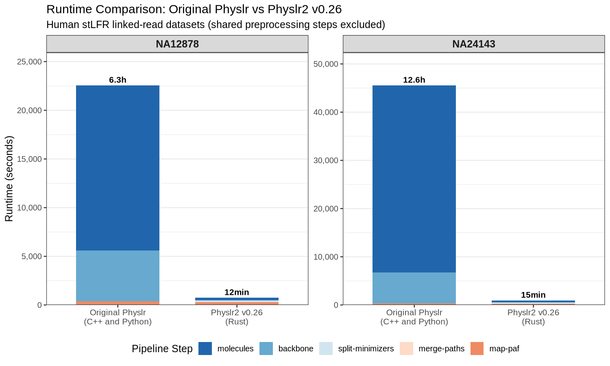

# Physlr2: Performance Comparison

Comparison of physical maps produced by the original Physlr (C++ and Python) and Physlr2 v0.26 (Rust) on two human cell lines using stLFR linked reads.

## Tools

| Tool | Language | Repository |
|------|----------|------------|
| **Original Physlr** | C++ and Python | [bcgsc/physlr](https://github.com/bcgsc/physlr) |
| **Physlr2 v0.26** | Rust | [aafshinfard/physlr2](https://github.com/aafshinfard/physlr2) |

## Datasets

| Sample | Technology | Source |
|--------|-----------|--------|
| NA12878 | stLFR | [GIAB FTP](https://ftp-trace.ncbi.nlm.nih.gov/ReferenceSamples/giab/data/NA12878/stLFR/) |
| NA24143 | stLFR | [GIAB FTP](https://ftp-trace.ncbi.nlm.nih.gov/ReferenceSamples/giab/data/AshkenazimTrio/HG004_NA24143_mother/stLFR/) |

Reference: GRCh38 (no alt analysis set).

---

## Runtime

Wall-clock time for the Physlr-specific pipeline steps (molecules, backbone, split-minimizers, merge-paths, map-paf). Preprocessing steps (ntcard, nthits, indexlr, filter-minimizers, overlap, filter-overlap) are shared between both tools and excluded.

| Sample | Original Physlr | Physlr2 v0.26 | Speedup |
|--------|:-:|:-:|:-:|
| NA12878 | 22,545s (6.3h) | 733s (12 min) | **31×** |
| NA24143 | 45,527s (12.6h) | 928s (15 min) | **49×** |

---

## Physical Maps

Reference chromosomes colored by backbone path. Each solid-color bar represents a single backbone path mapped to the reference genome.

### NA12878

| Original Physlr | Physlr2 v0.26 |
|:---:|:---:|
|  |  |
| 183 backbone paths | 102 backbone paths |

### NA24143

| Original Physlr | Physlr2 v0.26 |
|:---:|:---:|
|  |  |
| 87 backbone paths | 62 backbone paths |

---

## Pipeline Profiling

Wall-clock time and peak RSS for each step. Single compute node, 16 CPUs, 200 GB RAM. Steps 0a–4 use shared third-party tools; steps 5+ are Physlr-specific.

### NA12878

| Step | Tool | Time | Peak RSS |
|------|------|-----:|--------:|
| 0a. Count k-mers | ntcard | 2,601s | 517 MB |
| 0c. Find repeats | nthits | 25,749s | 34,816 MB |
| 0d. Build BF | physlr-makebf | 17s | 12,844 MB |
| 1. Index minimizers | indexlr | 8,143s | 9,555 MB |
| 2. Filter minimizers | physlr2 (CBF) | 2,666s | 64,867 MB |
| 3. Overlap | physlr2 | 1,325s | 118,473 MB |
| 4. Filter overlap | physlr2 | 1,945s | 19,168 MB |
| 5. Molecules | physlr2 | 230s | 14,561 MB |
| 6. Backbone | physlr2 | 48s | 4,195 MB |
| 7. Split minimizers | physlr2 | 181s | 24,085 MB |
| 8. Merge paths | physlr2 | 0s | 20 MB |
| 9. Map PAF | physlr2 | 274s | 42,109 MB |
| **Total** | | **43,179s** (12.0h) | |

### NA24143

| Step | Tool | Time | Peak RSS |
|------|------|-----:|--------:|
| 0a. Count k-mers | ntcard | 2,087s | 517 MB |
| 0c. Find repeats | nthits | 25,315s | 41,356 MB |
| 0d. Build BF | physlr-makebf | 20s | 13,174 MB |
| 1. Index minimizers | indexlr | 9,557s | 9,555 MB |
| 2. Filter minimizers | physlr2 (CBF) | 4,563s | 124,074 MB |
| 3. Overlap | physlr2 | 1,510s | 120,516 MB |
| 4. Filter overlap | physlr2 | 2,927s | 19,732 MB |
| 5. Molecules | physlr2 | 304s | 16,888 MB |
| 6. Backbone | physlr2 | 149s | 4,455 MB |
| 7. Split minimizers | physlr2 | 187s | 24,202 MB |
| 8. Merge paths | physlr2 | 0s | 12 MB |
| 9. Map PAF | physlr2 | 288s | 42,823 MB |
| **Total** | | **46,907s** (13.0h) | |

**Notes:**
- Steps 0a–4 use third-party tools shared between both implementations. The preprocessing dominates total runtime (~98%).
- Physlr2 v0.26 uses a cascading Bloom filter for singleton removal in step 2, reducing memory by ~40% compared to the exact HashMap approach.
- Molecules step uses `--seed 42` for deterministic results.

---

Click any thumbnail above to view the full-resolution image.
