# Physlr: Physical Map Comparison

Comparison of physical maps produced by the original Physlr (Python) and Physlr 2 (Rust) on two human cell lines using stLFR linked reads.

## Versions Compared

| Version | Description |
|---------|-------------|
| **Original Physlr** | Python + C++ implementation ([bcgsc/physlr](https://github.com/bcgsc/physlr)) |
| **Physlr 2 v0.10** | Rust rewrite, backbone extraction only (no merge-paths) |
| **Physlr 2 v0.23** | Rust rewrite with merge-paths enabled (ed=25, eh=4, ml=1) |
| **Physlr 2 v0.25** | v0.23 + cascading Bloom filter for singleton removal |

## Datasets

| Sample | Technology | Source |
|--------|-----------|--------|
| NA12878 | stLFR | [GIAB FTP](https://ftp-trace.ncbi.nlm.nih.gov/ReferenceSamples/giab/data/NA12878/stLFR/) |
| NA24143 | stLFR | [GIAB FTP](https://ftp-trace.ncbi.nlm.nih.gov/ReferenceSamples/giab/data/AshkenazimTrio/HG004_NA24143_mother/stLFR/) |

Reference: GRCh38 (no alt analysis set).

---

## NA12878

### Backbone View

Backbone paths colored by reference chromosome. Each horizontal bar is a backbone path; colors indicate which chromosome it maps to.

| Original Physlr | Physlr 2 v0.10 | Physlr 2 v0.23 | Physlr 2 v0.25 |
|:---:|:---:|:---:|:---:|
| [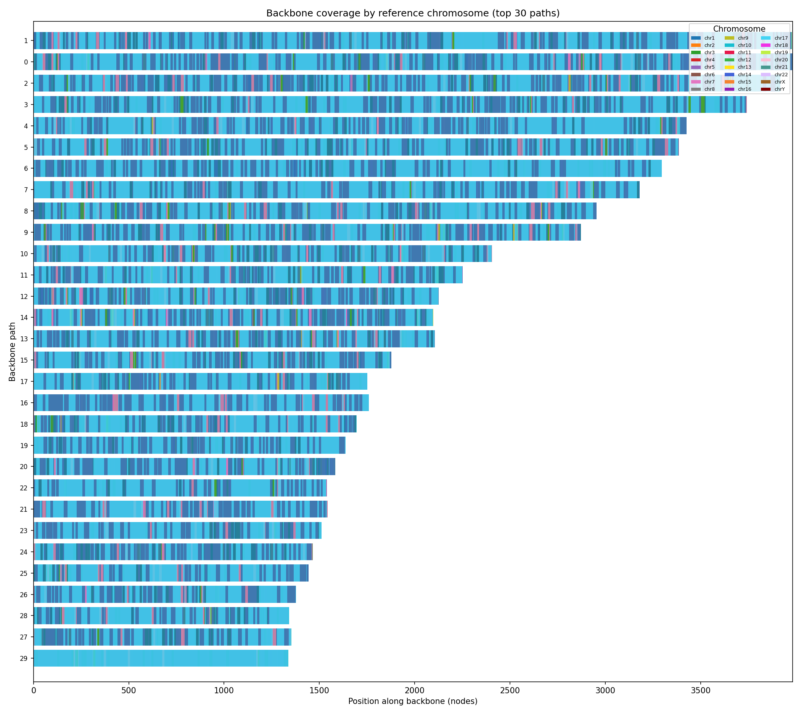](results/comparison/original_na12878_backbone_v2.png) | [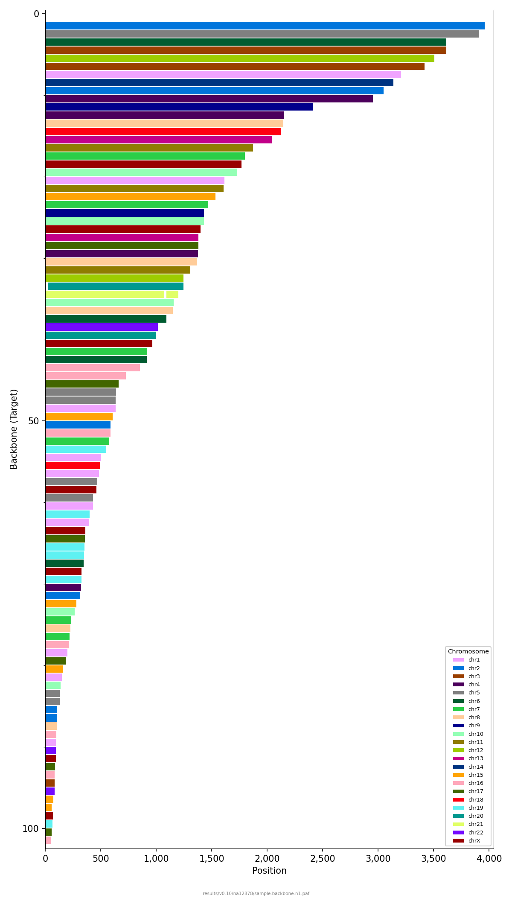](results/comparison/v010_na12878_backbone_v2.png) | [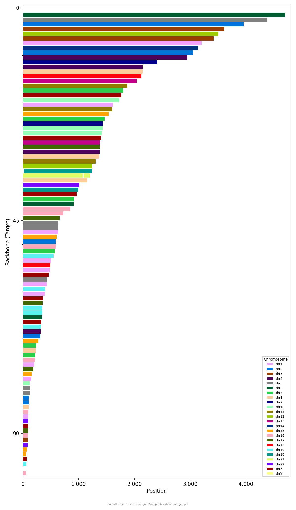](results/comparison/v023_na12878_backbone_v2.png) | [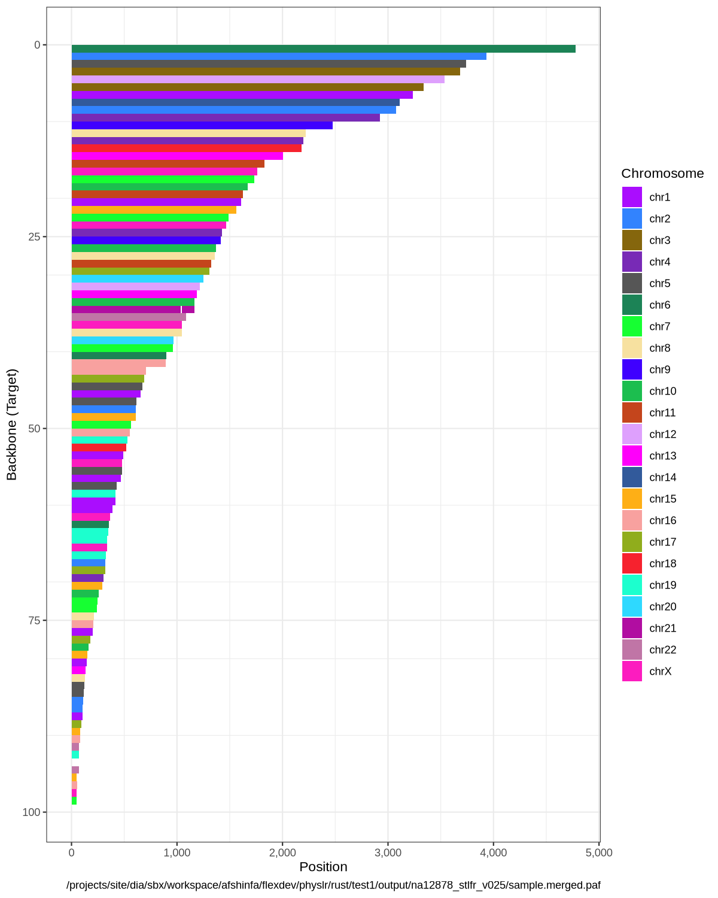](results/comparison/v025_na12878_backbone_v2.png) |

### Reference View

Reference chromosomes colored by backbone path. Shows how well the physical map covers each chromosome.

| Original Physlr | Physlr 2 v0.10 | Physlr 2 v0.23 | Physlr 2 v0.25 |
|:---:|:---:|:---:|:---:|
|  | [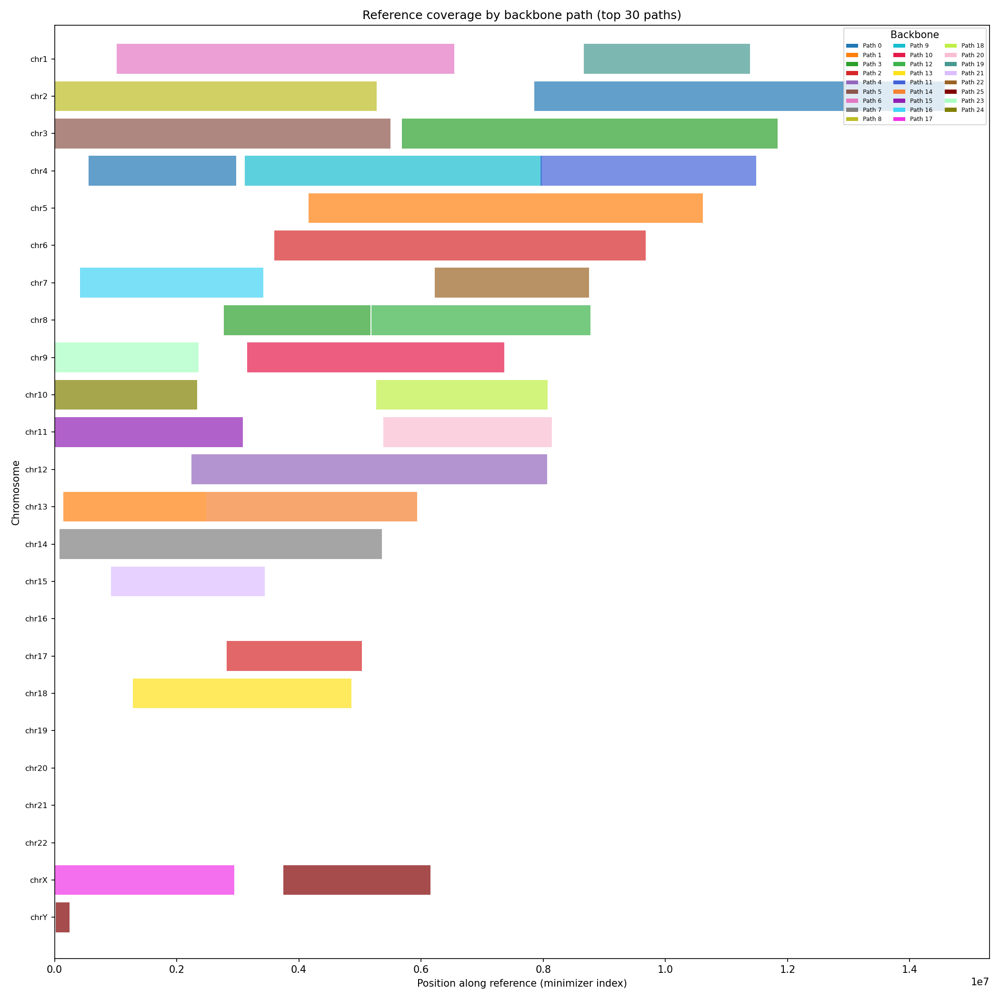](results/comparison/v010_na12878_reference_v2.png) |  | [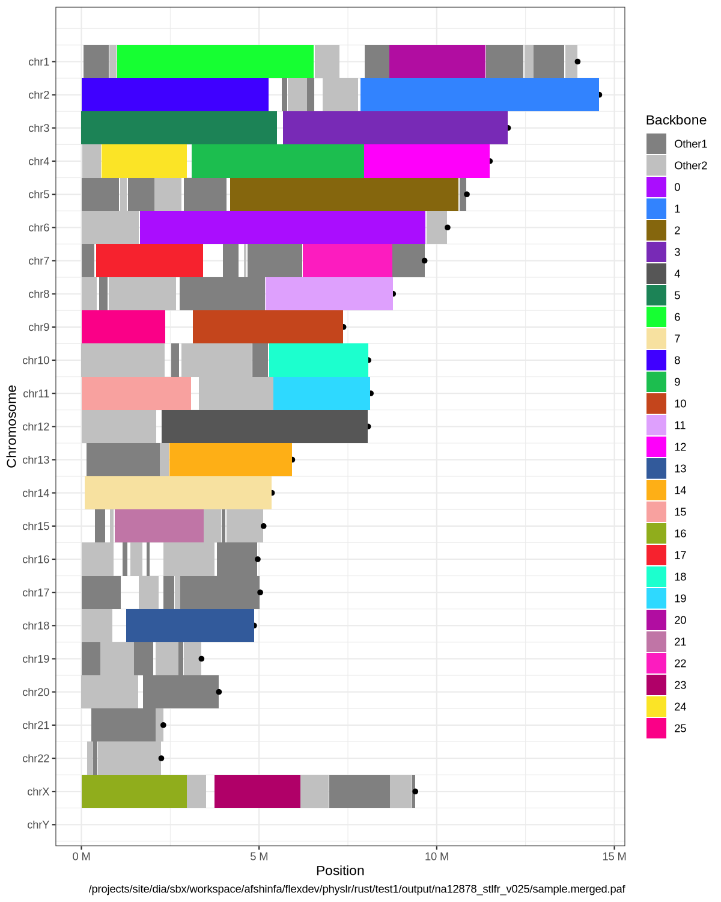](results/comparison/v025_na12878_reference_v2.png) |

---

## NA24143

### Backbone View

| Original Physlr | Physlr 2 v0.10 | Physlr 2 v0.23 | Physlr 2 v0.25 |
|:---:|:---:|:---:|:---:|
| [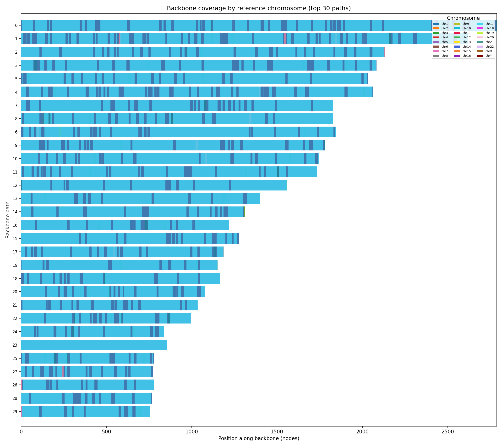](results/comparison/original_na24143_backbone_v2.png) | [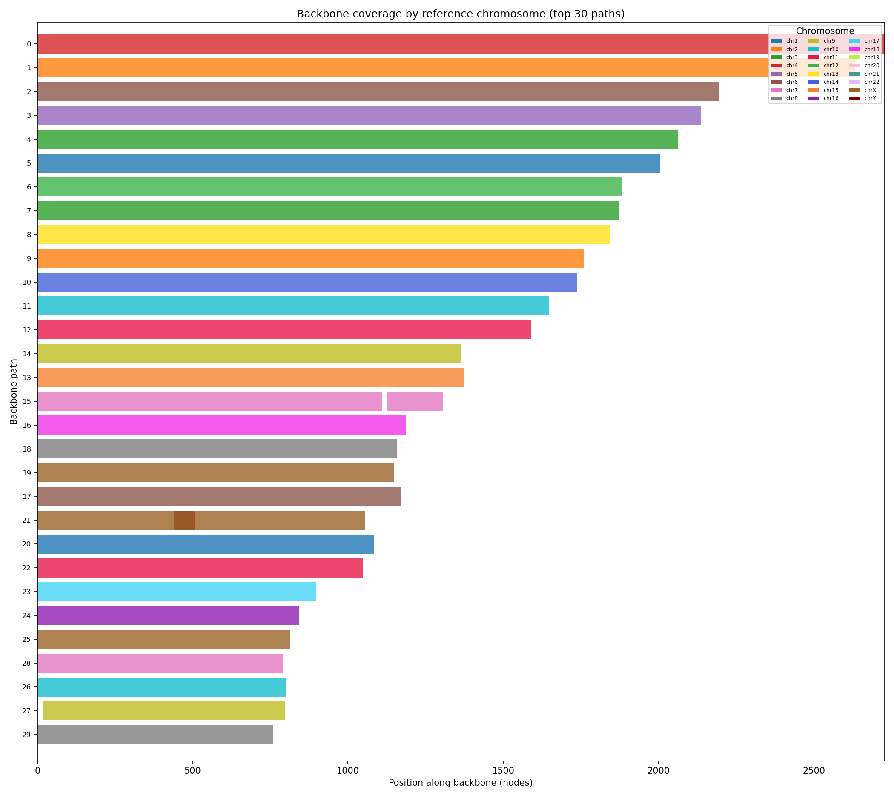](results/comparison/v010_na24143_backbone_v2.png) | [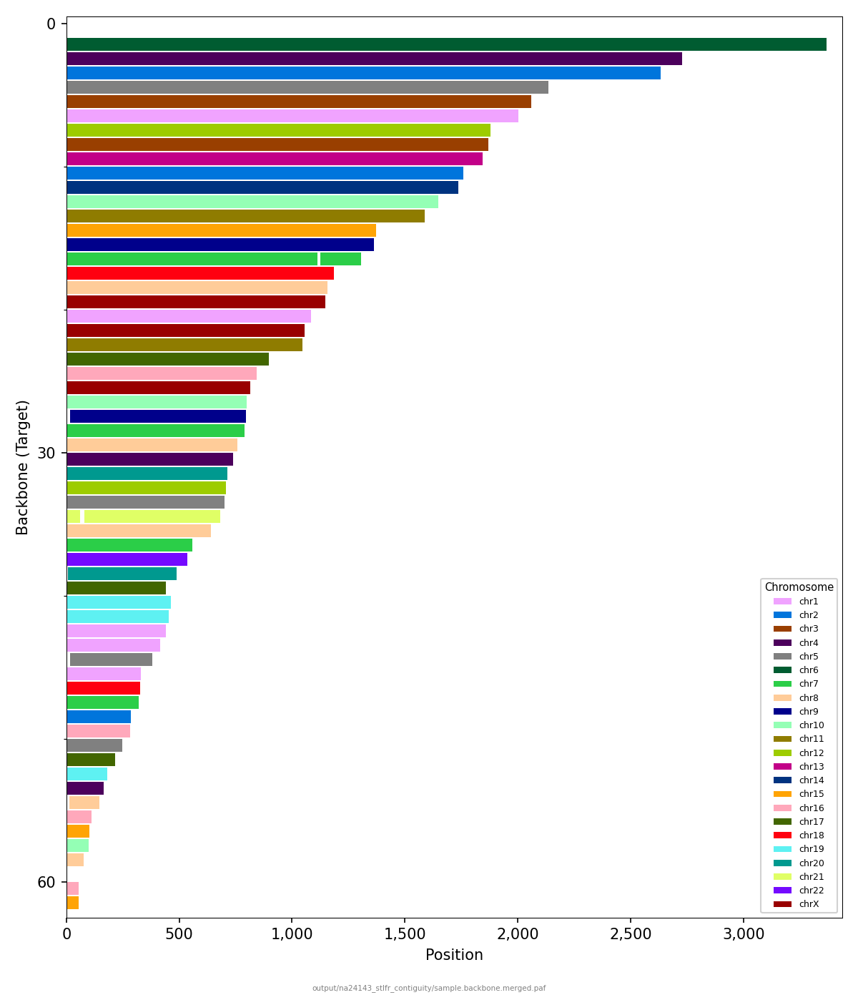](results/comparison/v023_na24143_backbone_v2.png) | [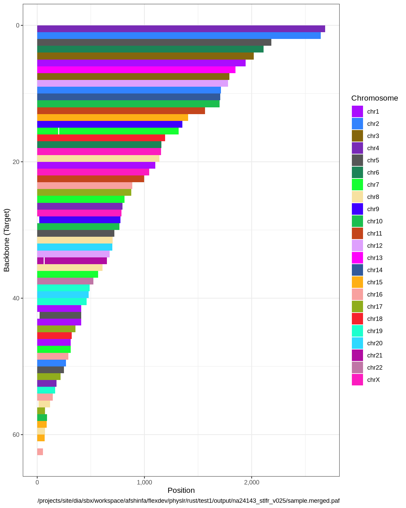](results/comparison/v025_na24143_backbone_v2.png) |

### Reference View

| Original Physlr | Physlr 2 v0.10 | Physlr 2 v0.23 | Physlr 2 v0.25 |
|:---:|:---:|:---:|:---:|
|  | [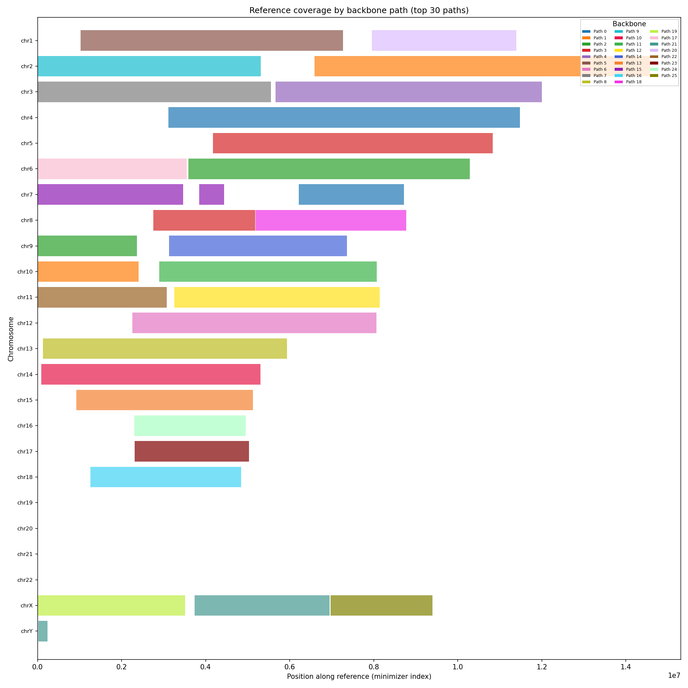](results/comparison/v010_na24143_reference_v2.png) |  | [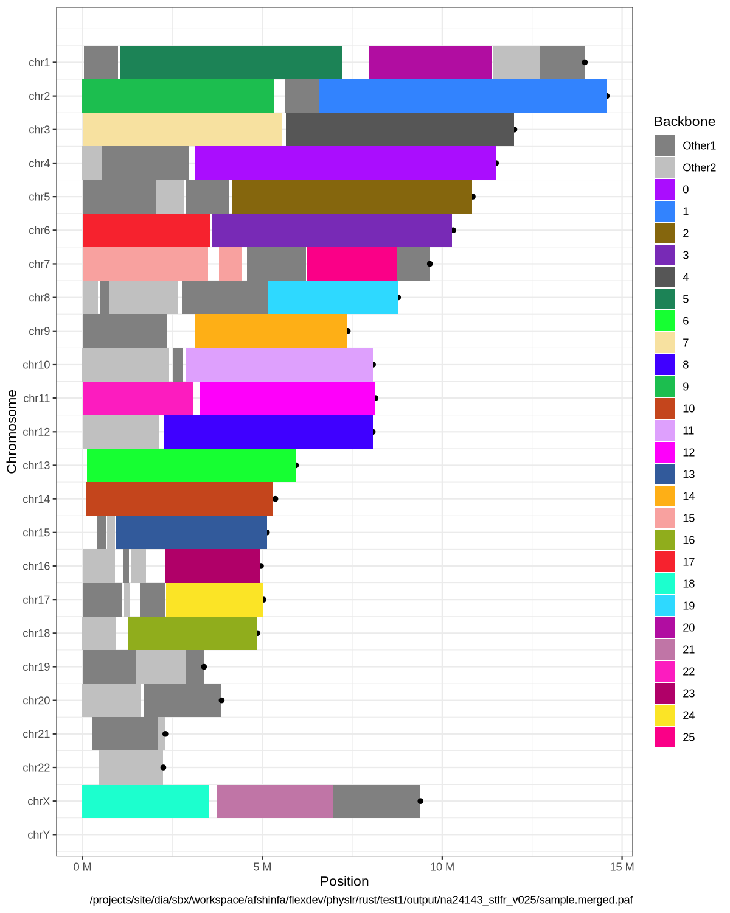](results/comparison/v025_na24143_reference_v2.png) |

---

## Physical Map Summary

### Path Counts

| Metric | Original Physlr | v0.10 | v0.23 | v0.25 |
|--------|:-:|:-:|:-:|:-:|
| **NA12878** backbone paths | 183 | 182 | 182 | 101 |
| **NA12878** merged paths | — | — | 179 | 99 |
| **NA24143** backbone paths | 87 | 63 | 63 | 63 |
| **NA24143** merged paths | — | — | 61 | 63 |

### Merge-Paths Results

| Sample | v0.23 Merges (TP / FP) | v0.25 Merges (TP / FP) |
|--------|:-:|:-:|
| NA12878 | 4 / 0 | 2 / 0 |
| NA24143 | 5 / 0 | 2 / 0* |

\* v0.25 NA24143: 7 candidate links found, 5 filtered as promiscuous endpoints, 2 accepted.

---

## Cascading Bloom Filter: filter-minimizers Verification (v0.25)

v0.25 replaces the exact HashMap-based singleton removal with a two-layer cascading Bloom filter. The BF uses ~600 MB for human-scale data vs ~6 GB for the HashMap.

### NA12878

| Metric | Exact (HashMap) | Cascading BF |
|--------|:-:|:-:|
| Wall time | 3,180s | 2,666s (**−16%**) |
| Peak RSS | 108,721 MB | 64,867 MB (**−40%**) |
| Output barcodes | 7,142,024 | 7,142,138 (+114) |

The 114 extra barcodes (0.002%) are from BF false positives — singleton minimizers that the BF incorrectly classified as non-singletons, causing a few extra barcodes to pass the min-count filter. This has no measurable effect on downstream results.

---

## Pipeline Profiling

Wall-clock time and peak resident set size (RSS) for each pipeline step on a single compute node (16 CPUs, 200 GB RAM allocation). Steps 0a–1 use third-party tools (ntcard, nthits, indexlr); steps 2+ are Physlr.

### NA12878

| Step | Tool | v0.10 Time | v0.10 RSS | v0.25 Time | v0.25 RSS | Original Time |
|------|------|:-:|:-:|:-:|:-:|:-:|
| 0a. Count k-mers | ntcard | 2,601s | 517 MB | 2,601s | 517 MB | — |
| 0c. Find repeats | nthits | 25,749s | 34,816 MB | 25,749s | 34,816 MB | — |
| 0d. Build BF | physlr-makebf | 17s | 12,844 MB | 17s | 12,844 MB | — |
| 1. Index minimizers | indexlr | 8,143s | 9,555 MB | 8,143s | 9,555 MB | — |
| 2. Filter minimizers | physlr | 3,180s | 108,721 MB | 2,666s | 64,867 MB | — |
| 3. Overlap | physlr | 1,325s | 118,473 MB | 1,325s | 118,473 MB | — |
| 4. Filter overlap | physlr | 1,945s | 19,168 MB | 1,945s | 19,168 MB | — |
| 5. Molecules | physlr | 186s | 17,377 MB | 230s | 14,561 MB | 16,929s |
| 6. Backbone | physlr | 57s | 4,965 MB | 56s | 4,171 MB | 5,253s |
| 7. Split minimizers | physlr | — | — | 362s | 36,696 MB | — |
| 8. Merge paths | physlr | — | — | 120s | 14,141 MB | — |
| **Total** | | **43,203s** (12.0h) | | **43,214s** (12.0h) | | **22,182s**+ |

### NA24143

| Step | Tool | v0.10 Time | v0.10 RSS | v0.25 Time | v0.25 RSS | Original Time |
|------|------|:-:|:-:|:-:|:-:|:-:|
| 0a. Count k-mers | ntcard | 2,087s | 517 MB | 2,087s | 517 MB | — |
| 0c. Find repeats | nthits | 25,315s | 41,356 MB | 25,315s | 41,356 MB | — |
| 0d. Build BF | physlr-makebf | 20s | 13,174 MB | 20s | 13,174 MB | — |
| 1. Index minimizers | indexlr | 9,557s | 9,555 MB | 9,557s | 9,555 MB | — |
| 2. Filter minimizers | physlr | 4,563s | 124,074 MB | *pending* | *pending* | — |
| 3. Overlap | physlr | 1,510s | 120,516 MB | 1,510s | 120,516 MB | — |
| 4. Filter overlap | physlr | 2,927s | 19,732 MB | 2,927s | 19,732 MB | — |
| 5. Molecules | physlr | 234s | 18,972 MB | 239s | 16,892 MB | 38,803s |
| 6. Backbone | physlr | 285s | 5,016 MB | 195s | 4,453 MB | 6,352s |
| 7. Split minimizers | physlr | — | — | 398s | 38,997 MB | — |
| 8. Merge paths | physlr | — | — | 138s | 17,037 MB | — |
| **Total** | | **46,498s** (12.9h) | | *pending* | | **45,155s**+ |

**Notes:**
- Steps 0a–4 are shared between v0.10 and v0.25 (same pre-computed data reused). v0.25 values for step 2 (NA12878) reflect the cascading BF; NA24143 CBF profiling is pending (job 36749595).
- Original Physlr times are for the Python (cpython) implementation. Steps 0a–4 used different tooling (physlr-overlap C++, physlr-filter-bxmx C++) and are not directly comparable, so they are omitted.
- The original Physlr total includes only molecules + backbone + visualization. The full original pipeline (including indexing) was not profiled end-to-end.
- Peak RSS is the maximum across all threads for that step.

### Speedup: Physlr 2 vs Original (molecules + backbone)

| Sample | Original | Physlr 2 v0.25 | Speedup |
|--------|:-:|:-:|:-:|
| NA12878 | 22,182s (6.2h) | 286s (4.8min) | **77×** |
| NA24143 | 45,155s (12.5h) | 434s (7.2min) | **104×** |

---

Click any thumbnail above to view the full-resolution image.
