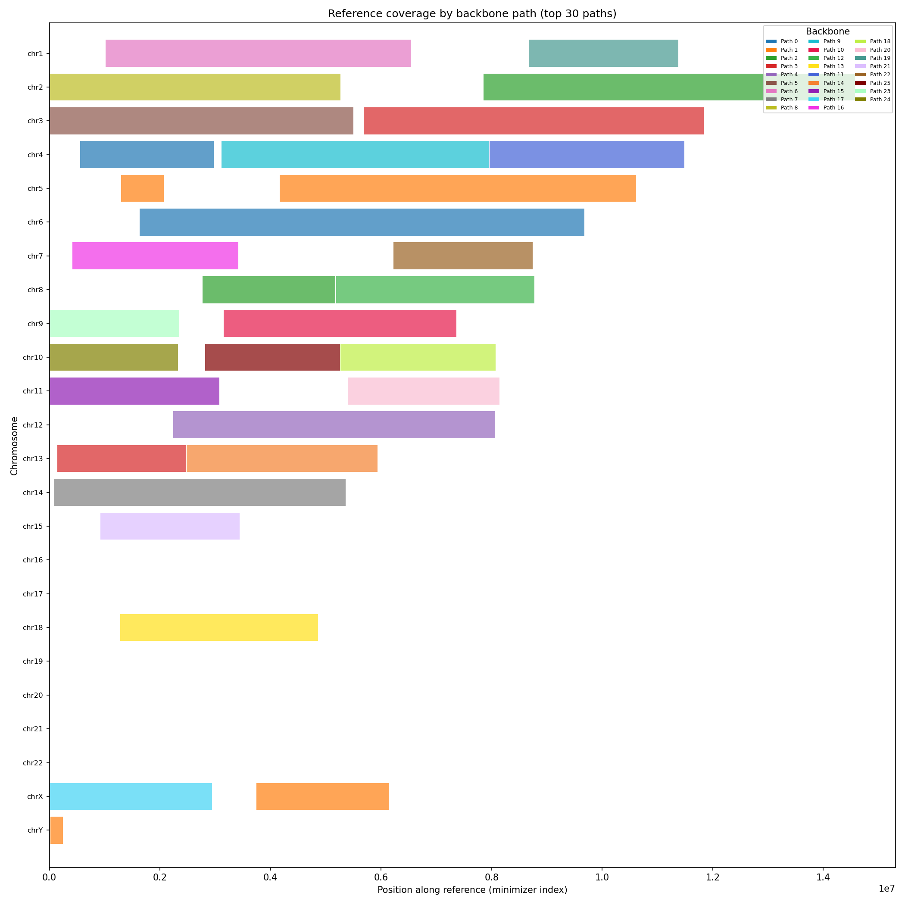
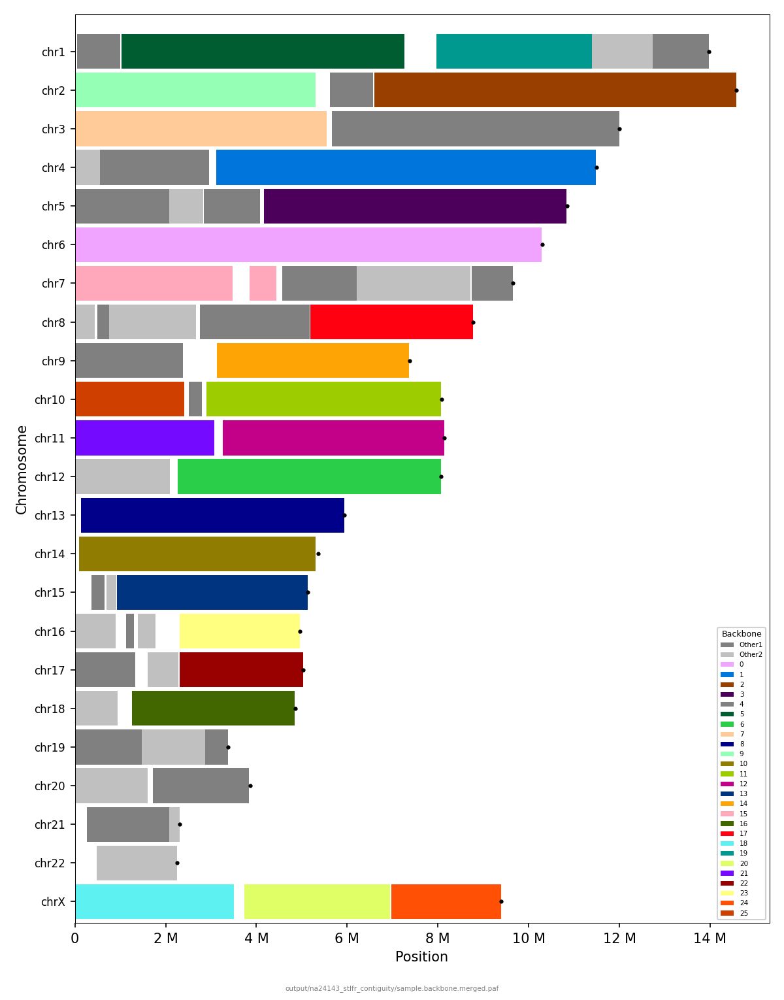

[](https://doi.org/10.3390/dna2020009)
[](https://www.gnu.org/licenses/gpl-3.0)
[](https://github.com/aafshinfard/physlr2/actions/workflows/ci.yml)

<p align="center">
  
</p>

<h1 align="center">Physlr 2</h1>

<p align="center">
  <b>Physical maps from linked reads — rewritten in Rust.</b><br>
  A ground-up rewrite of <a href="https://github.com/bcgsc/physlr">Physlr</a> for constructing <i>de novo</i> physical maps<br>
  from 10x Genomics Chromium or MGI stLFR linked-read data.
</p>

---

## Contents

- [Overview](#overview)
- [Installation](#installation)
- [Quick Start](#quick-start)
- [Pipeline Details](#pipeline-details)
- [Commands](#commands)
- [Parameters](#parameters)
- [Reproducing Results](#reproducing-results)
- [Project Structure](#project-structure)
- [Citation](#citation)

---

## Overview

Physlr 2 takes linked-read sequencing data and constructs ordered physical maps — sets of molecules arranged along each chromosome. These maps can then scaffold draft genome assemblies to chromosome-level contiguity.

<p align="center">
  
</p>

**Two main tasks:**

1. **Physical map construction** — builds an ordered map of molecules along each chromosome from linked-read barcodes.
2. **Assembly scaffolding** — uses the physical map to order and orient contigs from a draft genome assembly.

**Optional: merge-paths** — a post-processing step that identifies non-backbone "bridge" molecules sharing minimizers with endpoints of adjacent backbone paths, providing evidence to merge them. On human stLFR data (NA12878 + NA24143), this adds 9 true-positive merges with zero false positives.

### Results

Backbone paths mapped to the GRCh38 reference genome for two human cell lines:

| | NA12878 (stLFR) | NA24143 (stLFR) |
|:---|:---:|:---:|
| **Backbone** | [](results/na12878_backbone_v023.png) | [](results/na24143_backbone_v023.png) |
| **Reference** | [](results/na12878_reference_v023.png) | [](results/na24143_reference_v023.png) |

<sub>Backbone view: paths colored by reference chromosome. Reference view: chromosomes colored by backbone path. Click to enlarge.</sub>

---

## Installation

### 1. Install Rust

```bash
curl --proto "=https" --tlsv1.2 -sSf https://sh.rustup.rs | sh
source ~/.cargo/env
```

### 2. Build

```bash
git clone https://github.com/aafshinfard/physlr2.git
cd physlr2
cargo build --release
```

### 3. Install

Choose one:

```bash
# Option A: Add to PATH (recommended)
export PATH="$(pwd)/target/release:$PATH"

# Option B: Install to ~/.cargo/bin
cargo install --path .

# Option C: System-wide
sudo cp target/release/physlr /usr/local/bin/
```

### 4. Verify

```bash
physlr --version
physlr --help
```

### Optional dependencies

| Dependency | Purpose | Install |
|------------|---------|---------|
| [btllib](https://github.com/bcgsc/btllib) | Alternative minimizer extraction backend | `conda install -c bioconda btllib` |
| Python 3 + matplotlib | Backbone-vs-reference visualization | `pip install matplotlib` |
| [Snakemake](https://snakemake.readthedocs.io/) ≥ 7 | Automated workflow | `conda install -c bioconda snakemake` |
| [QUAST](https://github.com/ablab/quast) | Reference-based assembly evaluation | `conda install -c bioconda quast` |

---

## Quick Start

Physlr provides three commands, from most automated to most granular:

### `physlr pipeline` — End-to-end

Reads + draft assembly → physical map + scaffolds, all in one command.

```bash
physlr pipeline reads.fq.gz --draft draft.fa -o output/
```

**Output:**

| File | Description |
|------|-------------|
| `physlr.backbone.path` | Physical map (backbone paths) |
| `physlr.filtered.tsv` | Filtered barcode minimizers |
| `physlr.scaffolds.fa` | Scaffolded assembly |
| `physlr.report.json` | Before/after assembly metrics |

Add `-g` for NG50 reporting (optional):

```bash
physlr pipeline reads.fq.gz --draft draft.fa -o output/ -g 3088269832
```

---

### `physlr physical-map` — Physical map only

Reads → physical map, without scaffolding.

```bash
physlr physical-map reads.fq.gz -o output/
```

---

### `physlr scaffolds` — Scaffolding only

Uses an existing physical map (from `physical-map`) to scaffold a draft assembly.

```bash
physlr scaffolds output/physlr.backbone.path output/physlr.filtered.tsv draft.fa -o output/
```

Arguments:
1. Backbone path file (from `physical-map`)
2. Filtered minimizer TSV (from `physical-map`)
3. Draft assembly FASTA

---

### Step-by-step CLI

For full control over each stage:

```bash
# 1. Index minimizers from linked reads
physlr index reads.fq.gz -o reads.mxs.tsv -k 32 -w 32

# 2. Filter barcodes and minimizers
physlr filter-minimizers reads.mxs.tsv -o filtered.mxs.tsv -n 100 -N 5000

# 3. Compute barcode overlap graph
physlr overlap filtered.mxs.tsv -o overlap.tsv

# 4. Filter edges by percentile
physlr filter-overlap overlap.tsv -o overlap.filtered.tsv -p 85

# 5. Separate barcodes into molecules
physlr molecules overlap.filtered.tsv -o mol.tsv --strategy bc+cc

# 6. Extract backbone paths (physical map)
physlr backbone mol.tsv -o backbone.path

# 7. (Optional) Merge adjacent backbone paths
physlr split-minimizers mol.tsv filtered.mxs.tsv -o split.mxs.tsv
physlr merge-paths backbone.path split.mxs.tsv -o merged.path

# 8. (Optional) Scaffold a draft assembly
physlr index-contigs draft.fa -o draft.mxs.tsv
physlr map backbone.path filtered.mxs.tsv draft.mxs.tsv -o map.bed
physlr bed-to-path map.bed -o scaffold.path
physlr path-to-fasta draft.fa scaffold.path -o scaffolds.fa
```

---

## Pipeline Details

```
Linked reads (FASTQ + barcodes)
  │
  ├── index              Extract (k,w)-minimizers per barcode
  ├── filter-minimizers  Remove low/high-count barcodes, singleton minimizers
  ├── overlap            Compute barcode overlap graph (shared minimizers)
  ├── filter-overlap     Remove low-weight edges by percentile
  ├── molecules          Separate barcodes into individual molecules
  ├── backbone           MST → prune branches → extract paths
  │
  └──► Physical map (backbone paths)
         │
         ├── merge-paths       (Optional) Merge adjacent paths via bridge molecules
         ├── map / map-paf     Map contigs or reference to the physical map
         ├── bed-to-path       Convert mappings to scaffold paths
         ├── path-to-fasta     Produce scaffolded FASTA
         │
         └──► Scaffolded assembly
```

---

## Commands

### Pipelines

| Command | Description |
|---------|-------------|
| `pipeline` | End-to-end: FASTQ → physical map → scaffolded assembly |
| `physical-map` | Build a physical map from linked-read FASTQ files |
| `scaffolds` | Scaffold a draft assembly using an existing physical map |

### Indexing

| Command | Description |
|---------|-------------|
| `index` | Extract (k,w)-minimizers from FASTA/FASTQ, grouped by barcode |
| `index-contigs` | Extract ordered minimizers from FASTA contigs or reference |
| `repeat-filter` | Detect repetitive k-mers and build a Bloom filter |

### Graph Construction

| Command | Description |
|---------|-------------|
| `filter-minimizers` | Filter barcodes by count; remove singleton/repetitive minimizers |
| `overlap` | Compute barcode overlap graph from shared minimizers |
| `filter-overlap` | Remove low-weight edges by percentile |

### Molecule Separation

| Command | Description |
|---------|-------------|
| `molecules` | Separate barcodes into individual molecules |
| `split-minimizers` | Assign barcode minimizers to individual molecules |
| `trace-molecules` | Diagnostic: trace molecule separation for specific barcodes |

### Physical Map

| Command | Description |
|---------|-------------|
| `backbone` | Extract backbone paths from the molecule overlap graph |
| `merge-paths` | Merge adjacent backbone paths using bridge molecule evidence |

### Scaffolding

| Command | Description |
|---------|-------------|
| `map` | Map query sequences to the physical map (BED output) |
| `map-paf` | Map sequences to the physical map (PAF output, for visualization) |
| `bed-to-path` | Convert BED mappings to scaffold paths |
| `path-to-fasta` | Produce scaffolded FASTA from scaffold paths |

### Reporting

| Command | Description |
|---------|-------------|
| `metrics` | Compute assembly metrics (N50, NG50, etc.) |
| `path-metrics` | Compute physical map metrics |
| `backbone-dot` | Generate DOT visualization of backbone paths |

---

## Parameters

Most parameters have sensible defaults. The tables below are for advanced tuning.

### Core

| Parameter | Default | Description |
|-----------|---------|-------------|
| `-k` | 32 | K-mer size for minimizer extraction |
| `-w` | 32 | Window size for minimizer extraction |
| `-t` | auto | Number of threads (auto-detected, capped at 16) |
| `-v` | 1 | Verbosity: 0 = silent, 1 = info, 2 = debug |

### Barcode and Edge Filtering

Controls which barcodes and edges are kept in the overlap graph.

| Parameter | Default | Description |
|-----------|---------|-------------|
| `-n` / `--min-count` | 100 | Min minimizers per barcode (removes low-coverage barcodes) |
| `-N` / `--max-count` | 5000 | Max minimizers per barcode (removes chimeric/noisy barcodes) |
| `--min-shared` | 10 | Min shared minimizers to create an overlap edge |
| `-p` / `--percentile` | 90 | Remove the bottom N% of edges by weight (~85 for stLFR, ~92.5 for 10x) |

### Backbone Extraction

Controls how the minimum spanning tree is pruned to extract backbone paths.

| Parameter | Default | Description |
|-----------|---------|-------------|
| `--prune-branches` | 10 | Remove branches shorter than this from MST junctions |
| `--prune-bridges` | 10 | Remove bridge edges connecting components smaller than this |
| `--prune-junctions` | 200 | Remove junction branches shorter than this |
| `--min-component-size` | 50 | Discard backbone paths shorter than this (in molecules) |

### Merge-Paths <sub>(optional)</sub>

Merges adjacent backbone paths using bridge molecule evidence. Defaults optimized on human stLFR data for zero false positives.

| Parameter | Default | Description |
|-----------|---------|-------------|
| `--endpoint-depth` | 25 | Molecules from each path end used as endpoints |
| `--min-endpoint-hits` | 4 | Bridge must connect ≥ N endpoint molecules per side |
| `--min-bridges` | 2 | Min bridge molecules to accept a merge |
| `--min-shared-mx` | 3 | Min shared minimizers between bridge and endpoint |
| `--max-connections` | 2 | Discard bridges connecting > N paths (specificity) |
| `--max-links-per-endpoint` | 1 | Discard endpoints with > N candidate links (ambiguity) |
| `--min-bridge-density` | 0.01 | Min ratio of bridges to shorter path length |

### Scaffolding

| Parameter | Default | Description |
|-----------|---------|-------------|
| `-n` / `--min-score` | 10 | Min mapping score for contig-to-physical-map mapping |
| `--gap-size` | 100 | Ns inserted between scaffolded contigs |
| `-g` / `--genome-size` | — | Expected genome size in bp *(optional, for NG50 only)* |

---

## Reproducing Results

See **[REPRODUCING.md](REPRODUCING.md)** for step-by-step instructions to reproduce the NA12878 and NA24143 results shown above, including data download links and the automated pipeline script.

---

---

## Project Structure

```
physlr2/
├── Cargo.toml                 # Package manifest
├── src/
│   ├── main.rs                # CLI entry point (clap)
│   ├── lib.rs                 # Library root
│   ├── minimizer/mod.rs       # Minimizer extraction and filtering
│   ├── overlap/mod.rs         # Barcode overlap computation
│   ├── molecules/mod.rs       # Molecule separation
│   ├── graph/mod.rs           # Graph algorithms (MST, pruning)
│   ├── backbone/mod.rs        # Backbone extraction + merge-paths
│   ├── map/mod.rs             # Mapping to physical map
│   ├── scaffold/mod.rs        # Assembly scaffolding
│   ├── repeat/mod.rs          # Repeat k-mer detection (Bloom filter)
│   ├── report/mod.rs          # Metrics and reporting
│   └── io/mod.rs              # File I/O (TSV, FASTA, BED, gzip)
├── scripts/
│   ├── plotpaf.py             # Backbone-vs-reference visualization
│   ├── find-ntcard-mode.py    # K-mer histogram mode finder
│   └── profile_pipeline.sh    # Pipeline profiling (time + memory)
├── workflow/
│   ├── Snakefile              # Snakemake pipeline
│   └── scripts/               # Workflow helper scripts
├── results/                   # Example result plots
├── REPRODUCING.md             # Reproducibility instructions
└── LICENSE                    # GPL-3.0
```

---

## Citation

If you use Physlr, please cite:

> Afshinfard, A., Jackman, S.D., Wong, J., Coombe, L., Nikolic, V., Chu, J., Mohamadi, H., & Birol, I. (2022).
> **Physlr: Next-Generation Physical Maps.** *DNA*, 2(2), 116–130.
> [doi:10.3390/dna2020009](https://doi.org/10.3390/dna2020009)

---

## Support

[Open an issue on GitHub](https://github.com/aafshinfard/physlr2/issues)

## License

[GNU General Public License v3.0](LICENSE)
